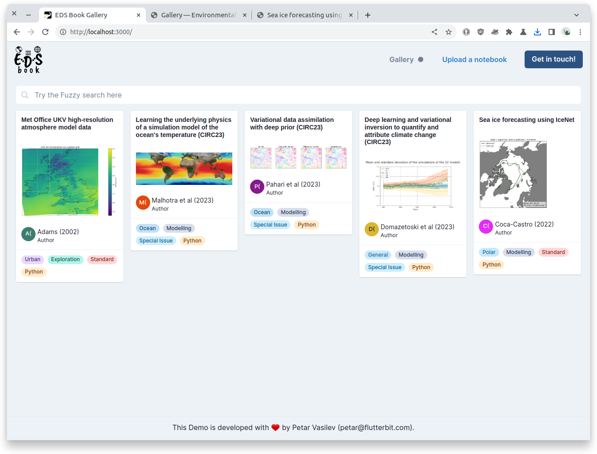

# Intro

This is a demo project to showcase some ideas about the [Environmental Data Science book website](https://edsbook.org/). This demo has a gallery of uploaded `.ipynb` notebooks such as the ones displayed [here](https://edsbook.org/notebooks/gallery).

When uploading a new notebook, the title and the tags are automatically detected. New tags, as well as an author and a cover image, can be added.

Those notebooks can be searched in the Gallery view. The notebooks can be opened in the web browser where the contents of the notebook can be viewed. This has an almost fully-featured rendering which can display code blocks, images and other types of data from the Jupyter Notebook.

# Demo Video

[Demo video link](https://drive.google.com/file/d/1No8AYOyGmT_n172VfE8OlNziceXKHNtt/view?usp=sharing)

# Running Locally

This is a React & Typescript project based on Next.js and Chakra UI.

You can run the development server:

```bash
yarn dev
```

Open [http://localhost:3000](http://localhost:3000) with your browser to see the result.

# Screen shots




# License

This project is created as a demo for [the EDS project](https://edsbook.org/) and is intended for use only by the authorized parties and the author.
